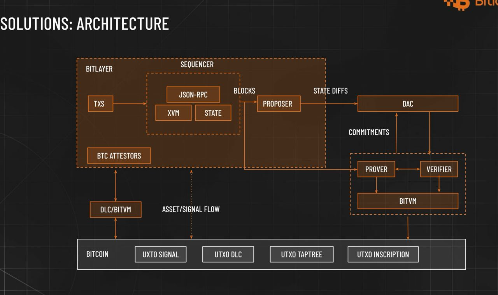
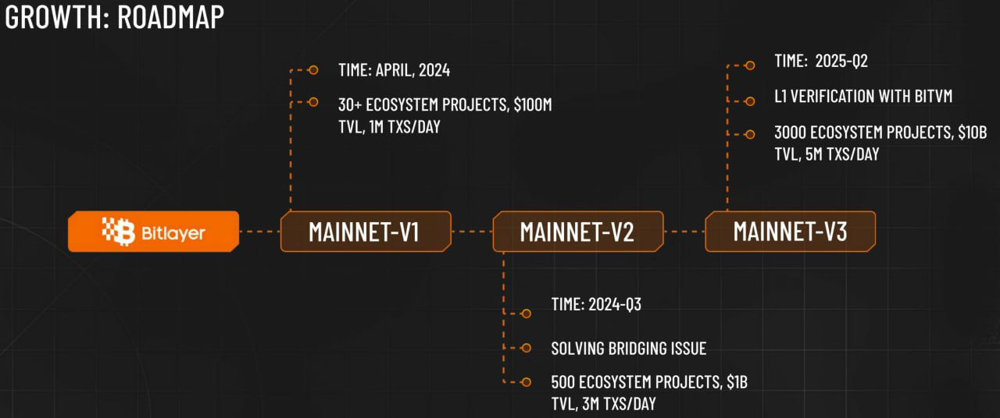

# Bitlayer Overview

Bitlayer is the first Bitcoin security-equivalent layer 2 based on BitVM. It consists an EVM compatible chain/sequencer(bitlayer-l2) that can map BTC ecological assets and facilitate the entry of BTC users. Bitlayer-l2 is a fork of [geth](https://github.com/ethereum/go-ethereum).

## Bitlayer’s Value Propositions
Due to the technical nature of Bitcoin, there exists a trade-off between "Security and Turing completeness" for Bitcoin layer2 solutions.

Bitlayer aims to resolve this dilemma and realize a Bitcoin layer 2 that is equally secure as Bitcoin and Turing complete through cryptographic innovations and blockchain protocol engineering. This is intended to ultimately foster a prosperous Bitcoin ecosystem.

## Technical Features
Bitlayer's core objective is to address the trade-off between security (trustless) and Turing completeness in BTC Layer 2. Based on this context, three key tasks are abstracted:

1. Trustless entry and exit of L1 assets
2. State transitions using a Turing-complete L2 virtual machine
3. L1 verification of the validity of L2 state transitions

Bitlayer innovatively utilizes the DLC/LN protocol to enable trustless bidirectional flow of signals/assets. It introduces VMs (EVM, SolanaVM, MoveVM, etc.) to support a wide range of state transition expressions.

## Architecture



Bitlayer subscribes to the typical model of an Optimistic Rollup equivalent.


## Roadmap



Bitlayer-l2 is the geth client in MAINNET-V1.

## Building the source

For prerequisites and detailed build instructions please read the [Installation Instructions](https://geth.ethereum.org/docs/getting-started/installing-geth).

Building `geth` requires both a Go (version 1.21 or later) and a C compiler. You can install
them using your favourite package manager. Once the dependencies are installed, run

```shell
make geth
```

or, to build the full suite of utilities:

```shell
make all
```

## Documentation

- The official documentation for the Bitlayer can be found [here](https://docs.bitlayer.org). It contains all the conceptual and architectural details of the chain along with operational guide for users running the nodes.

## License

The go-ethereum library (i.e. all code outside of the `cmd` directory) is licensed under the
[GNU Lesser General Public License v3.0](https://www.gnu.org/licenses/lgpl-3.0.en.html),
also included in our repository in the `COPYING.LESSER` file.

The go-ethereum binaries (i.e. all code inside of the `cmd` directory) are licensed under the
[GNU General Public License v3.0](https://www.gnu.org/licenses/gpl-3.0.en.html), also
included in our repository in the `COPYING` file.

## Interact With Us On Social Media

- Website: <https://bitlayer.org>
- Twitter: <https://twitter.com/BitlayerLabs>
- Medium: <https://medium.com/@Bitlayer>
- Email: <build@bitlayer.org>
- GitHub: <https://github.com/bitlayer-org>
